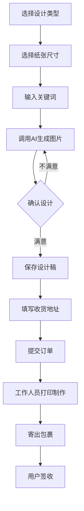

# 打印服务产品 PRD 文档

## 1. 产品概述

### 1.1 产品定位
本产品是一个在线设计与打印服务平台，用户可以通过AI生成图片，选择模板和纸张尺寸，制作海报、饭馆菜单、广告单页等印刷品，确认后提交打印订单，由平台工作人员完成打印制作并邮寄给用户。

### 1.2 核心价值
- **便捷设计**：通过AI技术，用户只需输入关键词即可生成专业设计稿
- **灵活定制**：支持多种纸张尺寸选择和自定义尺寸
- **一站式服务**：设计、确认、打印、配送全流程服务

### 1.3 目标用户
- 小型商家（餐厅、咖啡馆、零售店）
- 活动组织者（活动海报制作）
- 个人用户（个性化打印需求）

---

## 2. 功能需求

### 2.1 核心功能模块

#### 2.1.1 设计制作模块

| 功能点 | 需求描述 | 优先级 |
| :--- | :--- | :--- |
| AI图片生成 | 用户输入关键词，调用AI接口生成图片 | 高 |
| 模板选择 | 提供海报、菜单、广告单页等模板分类 | 高 |
| 纸张尺寸选择 | 支持标准尺寸（A4、A3、A5、B4、B5）和自定义尺寸 | 高 |
| 尺寸预览 | 实时预览图片与纸张尺寸的匹配效果 | 高 |

#### 2.1.2 订单管理模块

| 功能点 | 需求描述 | 优先级 |
| :--- | :--- | :--- |
| 订单提交 | 确认设计后提交打印订单 | 高 |
| 订单列表 | 查看历史订单状态 | 高 |
| 订单详情 | 查看订单具体信息（设计稿、尺寸、地址等） | 高 |
| 订单状态跟踪 | 打印中、已发货、已送达等状态 | 高 |

#### 2.1.3 用户信息模块

| 功能点 | 需求描述 | 优先级 |
| :--- | :--- | :--- |
| 收货地址管理 | 添加、编辑、删除收货地址 | 高 |
| 设计稿保存 | 保存历史设计稿供后续使用 | 高 |

### 2.2 业务流程



### 2.3 纸张尺寸规格

| 尺寸类型 | 尺寸（mm） | 说明 |
| :--- | :--- | :--- |
| A3 | 297 × 420 | 大尺寸海报 |
| A4 | 210 × 297 | 标准打印尺寸 |
| A5 | 148 × 210 | 小册子、传单 |
| B4 | 250 × 353 | 书籍封面 |
| B5 | 176 × 250 | 笔记本、手册 |
| 自定义 | 用户输入宽×高 | 灵活定制 |

---

## 3. 非功能需求

### 3.1 性能需求
- AI图片生成响应时间 ≤ 10秒
- 页面加载时间 ≤ 2秒
- 支持并发用户数 ≥ 100

### 3.2 安全性需求
- 用户数据加密存储
- 设计稿文件安全存储
- 防止未授权访问

### 3.3 兼容性需求
- 支持主流浏览器（Chrome、Firefox、Safari、Edge）
- 支持移动端访问

---

## 4. 技术架构

### 4.1 技术栈
- **前端框架**：React + TypeScript
- **UI组件库**：shadcn/ui
- **路由**：Tanstack Start
- **后端服务**：Supabase（用户认证、数据库）
- **AI接口**：待提供（预留接口）

### 4.2 数据模型

#### 4.2.1 用户表（users）

| 字段名 | 类型 | 说明 |
| :--- | :--- | :--- |
| id | UUID | 用户唯一标识 |
| email | string | 邮箱地址 |
| name | string | 用户姓名 |
| created_at | timestamp | 创建时间 |

#### 4.2.2 设计稿表（designs）

| 字段名 | 类型 | 说明 |
| :--- | :--- | :--- |
| id | UUID | 设计稿唯一标识 |
| user_id | UUID | 所属用户ID |
| title | string | 设计稿标题 |
| image_url | string | 生成的图片URL |
| paper_size | string | 纸张尺寸（如"A4"） |
| custom_width | number | 自定义宽度（可选） |
| custom_height | number | 自定义高度（可选） |
| keywords | string | 生成图片的关键词 |
| template_type | string | 模板类型（海报/菜单/广告） |
| created_at | timestamp | 创建时间 |

#### 4.2.3 订单表（orders）

| 字段名 | 类型 | 说明 |
| :--- | :--- | :--- |
| id | UUID | 订单唯一标识 |
| user_id | UUID | 所属用户ID |
| design_id | UUID | 关联的设计稿ID |
| status | string | 订单状态（待打印/打印中/已发货/已送达） |
| address | json | 收货地址信息 |
| quantity | number | 打印数量 |
| created_at | timestamp | 创建时间 |
| updated_at | timestamp | 更新时间 |

#### 4.2.4 地址表（addresses）

| 字段名 | 类型 | 说明 |
| :--- | :--- | :--- |
| id | UUID | 地址唯一标识 |
| user_id | UUID | 所属用户ID |
| name | string | 收件人姓名 |
| phone | string | 联系电话 |
| province | string | 省份 |
| city | string | 城市 |
| district | string | 区县 |
| detail | string | 详细地址 |
| is_default | boolean | 是否为默认地址 |
| created_at | timestamp | 创建时间 |

---

## 5. 界面原型说明

### 5.1 首页
- 产品介绍Banner
- 设计类型选择入口（海报、菜单、广告单页）
- 热门模板展示

### 5.2 设计页面
- 左侧：模板选择区域
- 中间：画布预览区域
- 右侧：属性设置面板（尺寸选择、关键词输入）
- 底部：生成按钮、保存按钮、提交订单按钮

### 5.3 订单页面
- 订单列表（状态筛选）
- 订单卡片（缩略图、状态、日期）
- 订单详情弹窗

### 5.4 用户中心
- 个人信息
- 地址管理
- 设计稿库
- 订单历史

---

## 6. 接口设计

### 6.1 AI图片生成接口（预留）

**POST /api/ai/generate**

请求体：
```json
{
  "keywords": "餐厅菜单 美食 简约风格",
  "width": 210,
  "height": 297,
  "templateType": "menu"
}
```

响应体：
```json
{
  "success": true,
  "imageUrl": "https://example.com/generated-image.png"
}
```

### 6.2 设计稿相关接口

| 接口 | 方法 | 说明 |
| :--- | :--- | :--- |
| /api/designs | GET | 获取用户设计稿列表 |
| /api/designs | POST | 创建设计稿 |
| /api/designs/:id | GET | 获取设计稿详情 |
| /api/designs/:id | PUT | 更新设计稿 |
| /api/designs/:id | DELETE | 删除设计稿 |

### 6.3 订单相关接口

| 接口 | 方法 | 说明 |
| :--- | :--- | :--- |
| /api/orders | GET | 获取用户订单列表 |
| /api/orders | POST | 创建订单 |
| /api/orders/:id | GET | 获取订单详情 |
| /api/orders/:id/status | PUT | 更新订单状态 |

### 6.4 地址相关接口

| 接口 | 方法 | 说明 |
| :--- | :--- | :--- |
| /api/addresses | GET | 获取用户地址列表 |
| /api/addresses | POST | 创建地址 |
| /api/addresses/:id | PUT | 更新地址 |
| /api/addresses/:id | DELETE | 删除地址 |

---

## 7. 运营与服务

### 7.1 打印服务流程
1. 用户提交订单后，系统通知工作人员
2. 工作人员下载设计稿并进行打印制作
3. 打印完成后进行质量检查
4. 包装并安排快递寄出
5. 更新订单状态为"已发货"并填写物流信息

### 7.2 服务承诺
- 订单确认后24小时内完成打印
- 全国范围内3-5个工作日送达
- 提供售后服务和质量保证

---

## 8. 后续扩展规划

### 8.1 中期规划（3-6个月）
- 添加更多模板类型（名片、邀请函、宣传单）
- 支持图片编辑功能（裁剪、滤镜、文字添加）
- 集成在线支付功能

### 8.2 长期规划（6-12个月）
- 支持批量打印订单
- 添加企业客户管理功能
- 扩展更多打印材质选择（铜版纸、牛皮纸等）

---

**文档版本**: v1.0  
**创建日期**: 2026年4月  
**适用范围**: 打印服务产品全团队